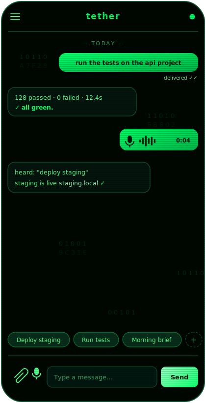
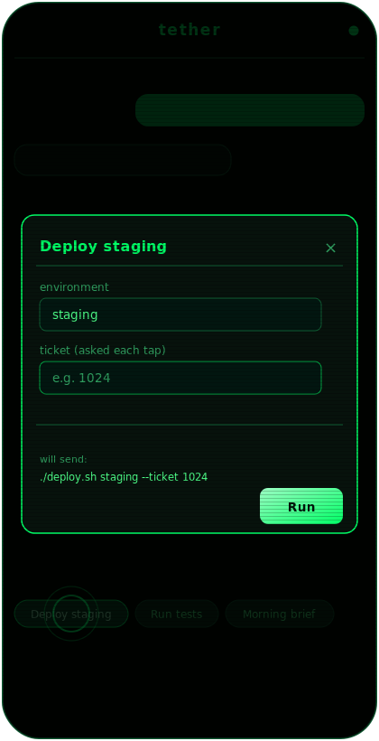
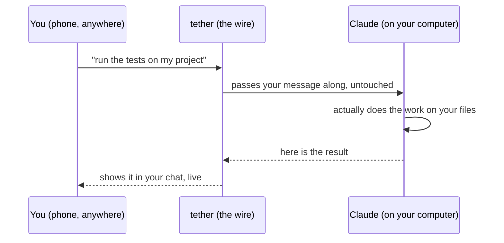

# tether

**Text your own computer from anywhere. Claude does the work and texts you back.**

<p align="center">
  
  &nbsp;&nbsp;
  
</p>

## The 10-second pitch

You already pay for Claude. It is brilliant, but it is stuck on your laptop. The
moment you walk away from the desk, it is out of reach.

tether is a **private chat line to your own computer.** From your phone, anywhere,
you send a message (type it, say it, or snap a photo). **Claude, running on your
machine, reads it, does the real work on your real files, and replies in the same
chat, live.**

No new AI to learn. Nothing leaves your machine. Just your computer, on a leash
you hold.

## Think of it as a "Closed Claw"

The open-ended AI agent tools (the "OpenClaw / Hermes" kind) *are* the robot: they
hold the brain, roam free, and decide for themselves what to do. Powerful, but
open-ended, and a little nerve-racking.

**tether is the opposite. It is a Closed Claw.**

- **Closed, not open.** It lives on *your* machine, on *your* private network,
  reachable only by *you*. Not on the open internet.
- **Your daily actions live on taps.** The things you do over and over become
  saved buttons. Tap **"Deploy staging"**, fill in a ticket number, hit **Run**.
  Done (that is the second screenshot above). Set up as many as you like.
- **The brain is one you already trust.** It is Claude, the assistant you already
  use, doing the work. tether itself adds no AI and makes no decisions.

An open agent wanders and improvises. A Closed Claw does exactly the few things
*you* set up, on exactly *your* stuff, and nothing more.

> Honest note: tether today is built around **Claude** (Claude Code on your Mac).
> Claude is the brain and the hands. tether is just the wire between you and it.

## What it actually is (the simple version)

A good picture: tether is a **walkie-talkie to your computer.** The walkie-talkie
is dumb on purpose. It just carries your message over and the reply back. All the
real work happens on the other end, where Claude is listening.

You type (or say, or photograph) what you want. The message lands on your computer
at home. Claude reads it, does the task, and the answer pops back into your chat.

That is the whole thing: a private chat between you and your own machine.

## What you can unleash

Anything you would normally do at the keyboard, now from your pocket:

- **"Run the tests on the api project and tell me if it is green."**
- **"Pull the latest, rebuild, and restart the dev server."**
- Send a **voice note**: *"summarize today's commits on main."*
- Snap a **photo** of an error on a screen: *"what is breaking here, and how do I
  fix it?"*
- Tap **"Morning brief"** and get your daily digest, no typing.
- Kick off a full **Claude Code coding session** on a repo from your phone, then
  pick it up at your desk later.

The work runs on your machine, touches your real files and tools, and stays
private. You are not waiting on a cloud queue, you are driving your own computer.

## How it works



The important part: **tether in the middle is not smart and never acts on its
own.** It runs no commands. It has no AI of its own. It only carries messages back
and forth and shows them to you. Every bit of thinking and doing happens in Claude
on your computer. We keep that line strict on purpose. It is what makes tether
safe and predictable.

## How is this different from things that sound similar?

**"Doesn't Claude already let you dispatch tasks?"** Yes, in *its own cloud*. That
is great for cloud work. tether is the other half: the work runs on **your own
computer**, so it can touch your real files, folders, and tools, and nothing
leaves your machine.

| | Claude's cloud dispatch | tether |
|---|---|---|
| Where the work happens | Anthropic's cloud | Your own computer |
| Can it touch your local files / tools? | No | Yes, directly |
| Who runs it | Anthropic | You |
| What it is | a hosted service | a private line you own |

Use Claude's cloud dispatch for cloud tasks. Use tether when the work has to
happen on **your** machine and stay private. They are friends, not rivals.

## Is it safe? (yes, here is why in plain terms)

Because tether can run real commands on your computer, you do not want strangers
reaching it. So it is **not on the open internet.** You reach it over
**Tailscale**, which is like a private road only your own devices are allowed on.
Everyone else simply cannot get to the door.

If you ever put it somewhere more public, you turn on a password (a "token"). For
a private-road setup, you do not need one.

## What you need

- A **Mac that stays on** (your always-on computer).
- **Claude** on that Mac (you use the Claude you already pay for, not a separate
  bill).
- **Tailscale**, so your phone and your Mac sit on the same private network.

## How to start it

Try it out (runs in your terminal, stops when you close it):

```bash
uv sync          # one-time setup: gets Python and the bits it needs
uv run tether    # then open http://127.0.0.1:4444 in a browser
```

Keep it running for real (installs it as a background service that survives
restarts and is not tied to any window):

```bash
bash deploy/install.sh     # start it for good
bash deploy/uninstall.sh   # remove it
```

`install.sh` figures out your paths automatically, so there is nothing personal to
edit by hand.

## A tiny glossary

- **Claude** — the AI assistant that does the actual work on your computer.
- **Routine** — Claude (or a small script) running on your machine, waiting for
  your messages and handling them. tether talks to it; it does the work.
- **Tap / Widget** — a saved button for something you do often, where some details
  are fixed and others you fill in when you tap it (like a ticket number).
- **Tailscale** — a private network just for your own devices, so only you can
  reach tether.

## The one rule that keeps it simple and safe

If a change would make tether *decide* something or *do* something on its own, it
does not belong in tether. It belongs in a Claude routine. tether is the wire,
nothing more.

## For the curious (the other docs)

- `specs.md` — the detailed design (architecture, protocol, data model).
- `ROUTINE_PROTOCOL.md` — how a routine talks to tether.
- `task-sequence.md` — the build steps, done one at a time.
- `docs/` — the tech choices and the coding rules.
