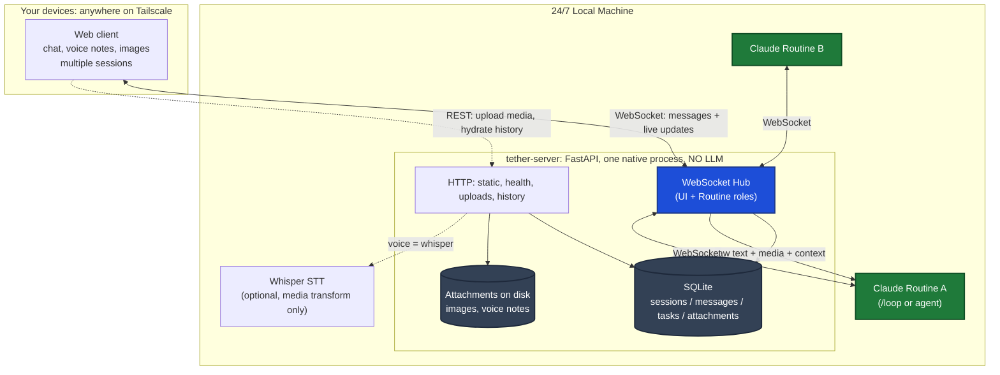
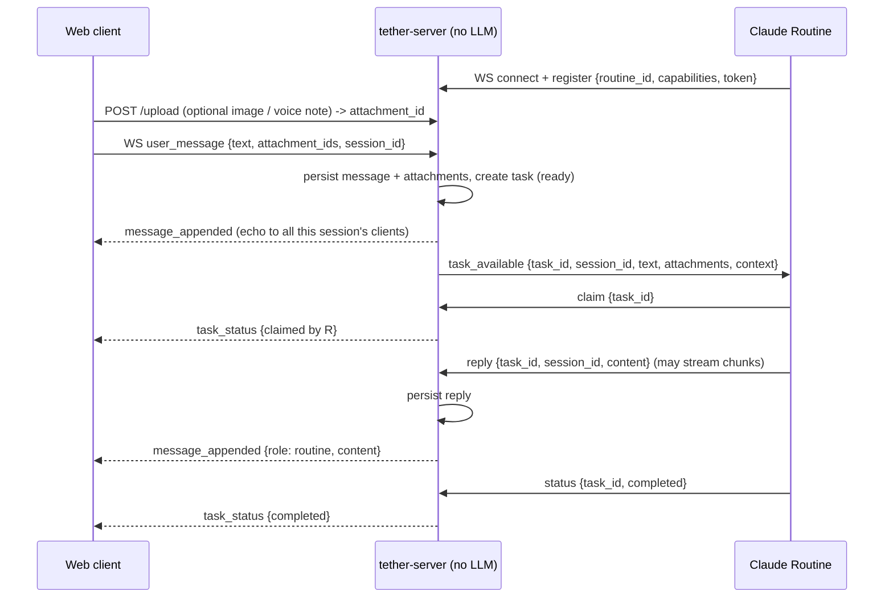
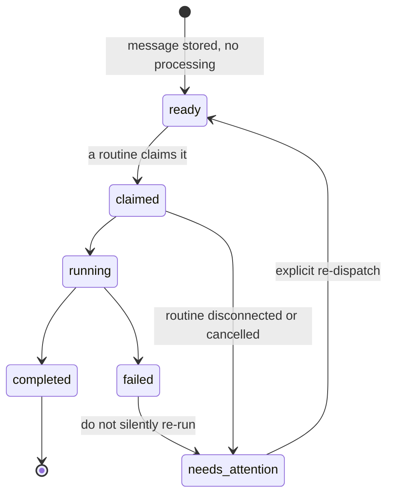

# tether: Specification (design doc)

> This is the **design** doc: what tether is, how it is shaped, and why. It is
> deliberately **not** a build spec to execute top to bottom. The actionable,
> pick-one-by-one tasks live in [`task-sequence.md`](./task-sequence.md); the
> pinned stack lives in [`docs/tech-stack.md`](./docs/tech-stack.md); the rules a
> coding session must follow live in [`docs/ai-rules/`](./docs/ai-rules/).

> A private, always-on **bridge** between you and the Claude routines running on
> your own machine. Open the chat from anywhere on your Tailscale network, on any
> device, send a message (text, voice note, or image), and a Claude routine picks
> it up, does the work, and streams its reply back into the same chat, live.

tether ("teacher / master") is **not** an agent and runs **no LLM of its own**.
It is a thin, fast surface that:

1. Accepts a message (text, voice note, image, file) from any of your devices.
2. Persists it and streams it live to your other connected chats.
3. Hands the **raw message plus media plus session context** to whichever Claude
   routine is listening. tether does not interpret or pre-digest it.
4. Streams that routine's reply back into the same session, live.

The intelligence and the doing live in the **routines** (Claude `/loop`s, agents,
scheduled jobs), which read the full, unaltered message and extract intent
themselves. tether is just the well-lit, private room where you and your routines
talk.

---

## 1. Principles

- **A pure bridge, no LLM inside.** tether carries messages and media between you
  and routines. It never runs a model to interpret, decide, route, or answer. A
  weak model upstream of a full Claude routine would only lose fidelity, so there
  is none.
- **tether never executes and never interprets.** It brokers messages and tasks.
  If no routine is connected, a task simply waits. Safety comes from this
  separation.
- **Full fidelity to the routine.** The routine receives the raw text, the
  attachments, and the session context, and works out intent itself. Nothing is
  paraphrased or dropped on the way.
- **Rich, private chat.** Text, voice notes, and image/file uploads, across all
  your devices, streamed live. The client is your own, so the data is yours (see
  section 15).
- **Routines are first-class clients.** They connect over WebSocket, register
  their identity, claim tasks, and report back. The protocol is documented and
  stable so you can wire a routine by hand.
- **Private, not public.** The network perimeter is Tailscale. tether adds a
  single shared-token check on top, nothing heavier.
- **Configurable, not hardcoded.** Voice mode, auth token, upload limits, and
  bind address come from one config file.

## 2. Non-goals (v1)

- **No LLM / intent processing inside tether.** No normalizer, no routing, no
  classification, no summarization-for-meaning. The routine does all of that.
- No action execution inside tether.
- **No chat-platform bridges.** Discord, Telegram, WhatsApp, and similar were
  evaluated and deliberately rejected: routing your messages through a third
  party breaks the private premise (see section 15). The client is ours.
- No multi-user accounts / RBAC (single trusted operator over Tailscale).
- No persistent message broker or distributed deployment.
- No agent orchestration logic. tether does not decide which routine does what;
  routines self-select by capability and by claiming.

---

## 3. Architecture



### Components

| Component | Responsibility |
|---|---|
| **WebSocket Hub** | The core. Maintains two connection registries (UI clients keyed by session, Routine clients keyed by routine id). Routes messages between them, broadcasts task and reply events. |
| **HTTP + static** | Serves the buildless frontend, `/health`, media **uploads/downloads**, and REST endpoints for session list and message history (so a fresh tab can hydrate before the socket connects). |
| **SQLite** | Single source of truth for sessions, messages, tasks, and attachment metadata. Survives restarts. |
| **Attachments on disk** | Image and voice-note bytes stored on the local filesystem; SQLite holds the metadata and path. |
| **Whisper (optional)** | Optional native speech-to-text, used only when `voice = whisper`. A **media transform** (audio to text), never intent. Off by default; the default voice path transcribes client-side. |
| **Claude Routines** | External processes you set up (a `/loop`, an agent, a cron). They connect as Routine clients, claim tasks, read the raw message + media + context, run locally, and report back. tether ships a protocol doc and a reference routine, not the routines themselves. |

### Tech stack

Pinned in [`docs/tech-stack.md`](./docs/tech-stack.md). In short:

- **Backend:** Python 3.12+, FastAPI + Starlette WebSockets, `aiosqlite`, run with
  `uv`. **No LLM library** in tether.
- **Frontend:** Buildless. Plain HTML/CSS/JS served as static assets, one
  WebSocket connection, the browser MediaRecorder API for voice notes, no npm and
  no build step. Swappable for Preact/htmx later without touching the contract.
- **Run model:** Native process, **not Docker**. One command via `uv`, kept alive
  as a `launchd` user service on the always-on machine. See section 8 for the why.

---

## 4. Core flow: message round-trip



Two key properties:

- tether does **no processing** between receiving and dispatching. The routine
  gets the message verbatim, with its attachments and the recent session history.
- The routine's `reply` carries the `session_id`, so tether fans it back to
  exactly the clients watching that session, on every device. You get an instant
  answer in the same chat you typed into.

---

## 5. WebSocket protocol

A single endpoint, `/ws`, with a role declared on connect. (UI and Routine may
be split into `/ws/ui` and `/ws/routine` at implementation time; the envelope is
identical.) Media is uploaded over HTTP first (see below), then referenced by id.

### Envelope

Every frame is JSON:

```json
{ "type": "user_message", "id": "<uuid>", "session_id": "<uuid|null>", "ts": "<iso8601>", "payload": { } }
```

### Media upload (HTTP, not WebSocket)

`POST /upload` (multipart) stores an image, voice note, or file and returns
`{ attachment_id, kind, mime, bytes }`. The id is then referenced in a
`user_message`. `GET /attachment/{id}` serves it back for display/download.

### UI client to server

| type | payload | meaning |
|---|---|---|
| `hello` | `{ token, session_id? }` | authenticate, optionally subscribe to a session |
| `user_message` | `{ text, attachment_ids[] }` | a new message (any of text/voice/image) |
| `subscribe` | `{ session_id }` | switch the live feed to another session |
| `cancel` | `{ task_id }` | abort an in-flight task |
| `ping` | `{}` | keepalive |

### Server to UI client

| type | payload | meaning |
|---|---|---|
| `welcome` | `{ session_id, sessions[] }` | accepted, here is your context |
| `message_appended` | `{ message_id, role, content, attachments[], ts }` | a user or routine message landed in the session |
| `task_status` | `{ task_id, state, claimed_by? }` | lifecycle update for a task |
| `error` | `{ code, message }` | rejected frame or server error |

### Routine client to server

| type | payload | meaning |
|---|---|---|
| `register` | `{ token, routine_id, name, capabilities[] }` | announce identity and what it can do |
| `claim` | `{ task_id }` | take ownership of a ready task |
| `reply` | `{ task_id, session_id, content, final? }` | send a result chunk or final answer |
| `status` | `{ task_id, state }` | report `running` / `completed` / `failed` |
| `heartbeat` | `{}` | liveness |

### Server to routine client

| type | payload | meaning |
|---|---|---|
| `registered` | `{ ok, since }` | registration accepted |
| `task_available` | `{ task_id, session_id, text, attachments[], context[] }` | a task is ready: the raw message, its media (urls + transcript), and recent session history |
| `claim_result` | `{ task_id, granted }` | claim accepted or lost to another routine |
| `revoke` | `{ task_id, reason }` | task pulled back (e.g. cancelled, or claimed routine died) |

`attachments[]` entries look like `{ id, kind, mime, url, path, transcript? }`.
`url` is for browser display; `path` is the **real host filesystem path** so a
host-native routine can open the file directly, with no HTTP fetch and no
container path translation. Images are read natively by a multimodal routine;
voice notes carry both the audio and the text `transcript`.

### Task lifecycle



There is no `normalizing` state: a message is `ready` to dispatch the instant it
is stored.

---

## 6. Data model (SQLite)

```
sessions(
  id TEXT PK, title TEXT, created_at, updated_at
)

messages(
  id TEXT PK, session_id FK, role TEXT,        -- user | routine | system
  content TEXT, task_id TEXT NULL, created_at
)

attachments(
  id TEXT PK, message_id FK, kind TEXT,        -- image | audio | file
  path TEXT, mime TEXT, bytes INTEGER,
  transcript TEXT NULL,                        -- audio only, when transcribed
  created_at
)

tasks(
  id TEXT PK, session_id FK, message_id FK,    -- the task IS the user message ('' for a help probe)
  state TEXT,                                  -- ready | claimed | running | completed | failed | needs_attention
  claimed_by TEXT NULL,                        -- routine_id
  created_at, updated_at,
  kind TEXT,                                   -- chat | help (help = a widget-builder --help probe)
  command TEXT NULL                            -- help probe only: the bare command name to run as `<command> --help`
)

routines(                                      -- last-known registry, live state is in-memory
  id TEXT PK, name TEXT, capabilities TEXT, last_seen
)
```

A task references its originating user `message`, so `task_available` is built by
reading the message text, its attachments, and recent session messages. A routine
reply is just a `messages` row with `role = 'routine'` linked by `task_id`, which
keeps history and live streaming on one path. Session titles are derived cheaply
(first line of the first message) or set by a routine; no model is used.

---

## 7. Messages, media, and full intent (tether runs no LLM)

tether hands the routine the **whole, unaltered message** so a full Claude can do
what it is good at: understand intent from raw input plus context. There is no
pre-processing step.

What the routine receives in `task_available`:

- `text`: exactly what you typed, untouched.
- `attachments[]`: images (by url, read natively by a multimodal Claude routine)
  and voice notes (audio url plus a text `transcript`).
- `context[]`: the recent messages in the session, so the routine has the thread.

### Voice notes

A voice note is recorded in the browser (MediaRecorder), uploaded, and stored as
an `audio` attachment. To reach the routine as intent it needs a text transcript,
because Claude reads text and images, not raw audio. Transcription is a **media
transform**, not interpretation, and is config-switched:

- `voice = browser` (default): the browser transcribes with the Web Speech API
  and sends the text alongside the audio. **tether runs no model at all.**
- `voice = whisper`: tether transcribes server-side with a local Whisper process.
  Still a pure audio-to-text transform; it never decides or interprets.
- `voice = none`: voice notes are stored and playable but not transcribed (a
  routine can transcribe them itself if it wants).

### Images and files

Stored as attachments and passed to the routine by url and by real host path. A
multimodal Claude routine reads images directly. Because tether runs natively,
every attachment also has a real filesystem path, so a routine on the same
machine can open it directly instead of fetching it. tether does nothing to them
beyond storing and serving.

### Folder picker

The composer's `/d` command opens a host directory browser (server endpoint
`GET /api/dirs`, directory names only, no file reads, token-gated when auth is
on). Selecting a folder inserts its absolute host path into the message, so a
routine on the same machine can act on the exact path you picked. `/c` is the
same idea for executable names on PATH (`GET /api/commands`).

### Widgets

Clickable buttons that fire a predefined command. Define one (name + command,
e.g. "Deploy staging" -> `./deploy.sh staging`); it is
stored server-side (`/api/widgets`, so it syncs across your devices) and clicking
it sends that command into the chat. Define as many as you like. tether still
runs nothing itself; the message goes to whichever routine is connected.

The builder fills the command from the program's own `--help`: you type a command
name and "Read parameters", and the options and positionals render as a form to
fill. Because tether must never execute anything, the `--help` run rides the task
queue like any other command (a `help` task: the connected routine runs
`<command> --help`), and tether relays the text back over a `help_result` frame to
the builder only, never into the chat thread. The server only accepts a bare
command name for the probe (no shell syntax), and the browser does the parsing.
The full command stays editable, so an imperfectly-parsed `--help` is never a dead
end.

Some parameters can be baked in and others left to fill at click time. In the
builder, mark a field "ask on click" and it becomes a `{{key}}` placeholder in the
saved command, with its current value kept as the click-time default. The widget
then stores its command template plus a `params` list (`{key, label, default}`,
held in a `widgets.params` JSON column). Clicking such a widget opens a small form
for just those inputs (e.g. ticket, branch), shows a live preview of the exact
command, and on submit substitutes the values (shell-quoted) and sends it. tether
only stores the template and params; the browser does the substitution, so tether
still never interprets or assembles anything.

This is the whole point of removing the old normalizer: a weak model paraphrasing
your message before a strong routine sees it can only lose meaning and add
latency. Full fidelity in, the routine figures out the rest.

---

## 8. Configuration

One file, `config.yaml` (overridable by env vars), read at boot:

```yaml
server:
  bind: 127.0.0.1        # loopback by default; reach it via Tailscale / a reverse proxy
  port: 4444
  auth_token: "change-me"   # shared token, checked on every WS connect

uploads:
  dir: "./data/attachments"
  max_mb: 25

voice:
  provider: "browser"       # browser (client-side STT, no server model) | whisper | none
  whisper_url: "http://127.0.0.1:9000"   # used only when provider = whisper
```

Env overrides exist for the essentials before the full loader lands, e.g.
`TETHER_HOST` and `TETHER_PORT`.

### Run model and deployment

tether runs as a **native process, not in Docker**. Start it with one command:

```bash
uv run tether            # starts the server
```

Keep it always-on with a `launchd` user service (macOS) shipped in `deploy/`:

```bash
cp deploy/com.tether.server.plist ~/Library/LaunchAgents/
launchctl load ~/Library/LaunchAgents/com.tether.server.plist
```

Reach it privately. tether binds `127.0.0.1`; expose it over your tailnet with a
reverse proxy. On a Dockerized Nginx Proxy Manager, forward
`http://host.docker.internal:4444` (Docker Desktop on Mac reaches the host
loopback, so no `0.0.0.0` bind is needed). Or use `tailscale serve`.

**Why no Docker (decided deliberately):** tether is a single Python process plus
one SQLite file and a folder of attachments, living on the same machine as the
Claude routines. Native wins on every axis that matters here:

- Routines and tether talk over flat `localhost` with no container network
  boundary, which keeps the real-time WebSocket path simple and direct.
- **Shared host filesystem.** tether stores attachments at real host paths, and
  any path you reference in chat (`/Volumes/...`) resolves identically for a
  routine on the same machine. A container would hide files behind volume mounts
  and path translation, making them harder for the routine to find.
- An optional local model (Ollama, or Whisper for voice) needs the Mac GPU, which
  Docker Desktop on macOS cannot pass through.
- Always-on is cleaner as a `launchd` user service than a daemonized container,
  and `uv` already gives reproducible, locked dependencies without a container.

Docker would only earn its place if tether later moved to a headless Linux box.
That is out of scope (see section 12).

---

## 9. Security

- Network perimeter is **Tailscale** plus a reverse proxy. tether binds
  `127.0.0.1`; it is never directly on a public address.
- A single **shared `auth_token`** is required on every WebSocket connect (UI and
  Routine). Missing/wrong token means the connection is rejected.
- If the chat is exposed through a public reverse-proxy host, put an access list /
  basic auth on it: tether has no per-user auth, so the proxy is the door.
- Routine clients additionally present their `routine_id`; the server keeps a
  registry so the UI can show "picked up by Routine A".
- Uploads are size-capped (`uploads.max_mb`) and stored on the local disk only.
- No secrets in the frontend bundle. The token is entered once in the UI and kept
  in browser storage.

---

## 10. Roadmap shape (design view)

Design context only. The real, pick-one-by-one tasks with acceptance criteria are
the single source of truth for execution and live in
[`task-sequence.md`](./task-sequence.md). Do not treat this section as a build
spec.

- **M0 Foundation:** native scaffold, one-command boot, `/health`, empty UI shell.
- **M1 Walking skeleton:** text message to a hand-wired routine and back, live.
  Includes the routine connector (`tether-connect`), pending-task replay, and
  visible failures (gaps A, B, C).
- **M2 Multiple sessions:** isolated, persistent sessions across devices.
- **M3 Image uploads:** attach images; routine receives them by url.
- **M4 Voice notes:** record in-browser, store + transcribe (browser default,
  optional Whisper); routine receives audio url + transcript.
- **M5 Routine registry:** capabilities, claiming, status in the UI, cancel,
  re-dispatch safety (gaps E, F, G).
- **M6 Config and validation:** one config file, fail-fast boot checks (gap K).
- **M7 Auth and reachability:** shared-token check, documented private exposure.
- **M8 Polish:** reconnect, markdown, mobile/PWA, status view, limits (gaps H, I, J).

```mermaid
gantt
    title tether milestone ladder
    dateFormat X
    axisFormat %s
    section Foundation
    M0 Skeleton and boot        :m0, 0, 1
    M1 Walking skeleton         :m1, after m0, 2
    section Chat
    M2 Multiple sessions        :m2, after m1, 1
    M3 Image uploads            :m3, after m2, 1
    M4 Voice notes              :m4, after m3, 1
    section Routines and prod
    M5 Routine registry         :m5, after m4, 2
    M6 Config and validation    :m6, after m5, 1
    M7 Auth and reachability    :m7, after m6, 1
    M8 Polish                   :m8, after m7, 1
```



---

## 11. Proposed repo layout

```
tether/
  pyproject.toml               # deps + entry points, managed by uv
  uv.lock
  config.example.yaml
  README.md                    # what tether is and why
  specs.md                     # this design doc
  task-sequence.md             # the actionable task list (execute this)
  ROUTINE_PROTOCOL.md          # the WS contract for routine authors
  docs/
    tech-stack.md              # pinned stack + the no-Docker rationale
    ai-rules/                  # exact rules a coding session must follow
  deploy/
    com.tether.server.plist    # launchd user service (always-on)
  server/
    main.py                    # FastAPI app, routes, static mount
    hub.py                     # WebSocket hub: registries + routing
    protocol.py                # envelope + message type schemas
    uploads.py                 # media upload/download + (optional) Whisper STT
    db.py                      # aiosqlite access layer (WAL)
    config.py                  # config.yaml + env loader
  web/                         # buildless frontend
    index.html
    app.js                     # one WebSocket, sessions, recorder, uploads
    style.css
  cli/
    tether_connect.py          # routine connector CLI: next / reply / done / fail
  routines/
    reference_routine.py       # minimal example routine, uses tether-connect
  tests/
    test_round_trip.py
    test_sessions.py
    test_media.py
    test_claiming.py
```

---

## 12. Open questions / future

- **Streaming replies:** v1 supports `reply` chunks; whether the UI renders token
  streaming or whole messages is a polish decision (M8).
- **Task fan-out:** v1 assumes one routine claims one task. Broadcast-to-many or
  capability-based pre-filtering can come later, still driven by routines.
- **Push notifications:** the one thing a chat platform would have given for free.
  A PWA with Web Push is the path to mobile alerts without a third party (M8).
- **History/attachment retention:** SQLite and the attachments folder grow
  unbounded; add pruning/export if needed.
- **Optional local model:** if a non-Claude or offline consumer is ever needed,
  a local model could be added behind config, but it stays out of the core bridge.
- **Linux / headless future:** if tether ever runs on a remote Linux box instead
  of the local Mac, a container image becomes worthwhile. Out of scope for now.

---

## 13. Bare-minimum gaps to close (skipped on the first pass)

These are not "future ideas" (section 12). They are the smallest set of things
the design above quietly assumes but does not yet specify.

### Blocking for M1 (the walking skeleton breaks without these)

- **A. The routine connector (the missing glue).** A Claude `/loop` or agent does
  not naturally hold a WebSocket open or react to pushed frames. Ship a thin
  **`tether-connect`** client/CLI that holds the socket for the routine and
  exposes plain verbs:
  - `tether-connect next` -> blocks, prints the next claimable task as JSON, claims it.
  - `tether-connect reply <task_id> "<text>"` -> sends a reply to the session.
  - `tether-connect done <task_id>` / `fail <task_id> "<why>"` -> close out the task.

  A routine then becomes trivial: a `/loop` that calls `next`, does the work,
  calls `reply` + `done`. This is the single most important skipped piece, and
  `routines/reference_routine.py` should be built on top of it.

- **B. Pending-task replay on register.** When a routine connects, the server must
  immediately send it everything already in `ready`. Without this, any message you
  sent while no routine was connected is silently lost.

- **C. Failures must surface in the chat, not just a status chip.** When a routine
  reports `failed` (or dies mid-task), write a visible `system` message into the
  session. Otherwise a dead task looks identical to silence.

### Needed by M5 (correctness under real use)

- **E. Re-dispatch safety / idempotency.** Auto-returning a claimed task to `ready`
  when its routine dies can double-run non-idempotent work. Default to marking such
  tasks `needs_attention` and requiring an explicit re-dispatch, with silent
  auto-retry behind a config flag.

- **F. Cancel / stop from the UI.** A `cancel` frame (UI to server to `revoke`)
  lets you abort a fired message.

- **G. SQLite reliability for async writes.** Enable WAL mode and funnel writes
  through a single connection/queue, so concurrent UI + routine writes never hit
  `database is locked`.

### Hygiene before calling it done (M6 to M8)

- **H. Frame-size and upload limits.** Cap WS frame size, reply chunk volume, and
  upload size so a runaway reply or a huge file cannot flood the UI or the disk.
- **I. Concrete heartbeat timeout + stale-routine eviction.** Pick a value (e.g.
  drop a routine after 30s of no heartbeat) and define what happens to its
  in-flight task (see E).
- **J. A `/status` view.** Connected routines, in-flight tasks, last error. The
  minimum observability to debug an unattended machine remotely.
- **K. Fail-fast config validation on boot.** Refuse to start (or loudly warn) on a
  default/empty `auth_token` or a missing uploads dir.

**Sequencing:** A, B, C belong in M1; E, F, G in M5; H to K ride along with M6 to
M8. This ordering is baked into [`task-sequence.md`](./task-sequence.md), which is
what you execute against.

---

## 14. Positioning: why tether is not OpenClaw or Hermes

tether looks adjacent to autonomous personal-agent frameworks (OpenClaw, the
Nous Research Hermes Agent, and similar). It is deliberately the **inverse** of
them, and the difference is the entire reason it exists.

**OpenClaw / Hermes are the agent.** They embed the model loop and take actions
(run shell, control the browser, read/write files, send email), expose themselves
through chat platforms (WhatsApp, Telegram, Slack, Discord), and self-improve with
persistent memory. To work well they need a strong, large-context model (128k+),
fed via a paid API or a heavy local model.

**The economic constraint that shapes tether:** a Claude Max/Pro subscription
powers the Claude apps and Claude Code and **cannot be used as an API key**. The
official, subscription-billed way to run Claude autonomously is **Claude Code
Routines**. That is the one source of strong-model capability you already pay for.

**tether's bet:** be a dumb, private bridge that never executes and never
interprets, and hand full-fidelity messages to Claude routines. The strong brain
is the routine (your subscription); tether adds zero model of its own.

| | OpenClaw / Hermes | tether |
|---|---|---|
| Role | The autonomous agent | A pure bridge (not an agent) |
| Brain | Strong model (128k+), costs money | None inside tether; the routine is the brain |
| Executes actions | Yes | No, never |
| UI | Third-party chat platforms | Your own private web client (text, voice, image) |
| Cost | Per-token for a strong model | Reuse the existing Claude subscription |
| Data | Through the chat platform's servers | Stays on your box and tailnet (section 15) |
| Memory / skills | In-framework, self-improving | Out of scope (lives in the routines) |

**On Discord and other chat platforms:** evaluated and rejected. Using one as the
UI would route every message through a third party (breaking the private premise)
and would make tether a thinner OpenClaw. Your own client keeps the data yours and
lets the UI render tether's own semantics (task lifecycle, which routine picked it
up, cancel, status). Decision: custom client only.

### Guardrail against drift (operational)

tether's job is **transport + presentation**. The brain and the hands live in the
routines. The moment tether embeds a model that interprets, acts on your
environment, or grows learned memory, it stops being tether.

**The litmus test for any feature:**

> Does this feature make a decision, interpret intent, or change anything outside
> tether's own message/attachment store? If yes, it belongs in a routine. If it
> only moves and displays messages and media, it is tether.

**Allowed vs forbidden:**

| Allowed (tether) | Forbidden (belongs in a routine) |
|---|---|
| Media transcoding for transport/display: speech-to-text, image thumbnails. **Transcription only, never interpretation.** | Any model that interprets intent, decides, routes, classifies, or answers |
| A chat log / transcript + attachments in SQLite and on disk | Learned memory: preferences, skills, self-improvement |
| Operations on its own state (DB, files it stores, serving, routing frames) | Acting on your environment: shell, files outside its store, browser, email, work-doing calls |

**Watchpoint:** tether runs **no intent LLM at all**. The only model it may ever
run is speech-to-text, and only to turn a voice note into text for display and for
the routine; it must never interpret or decide. With the default `voice = browser`
(client-side STT), tether has zero models in it. If anyone proposes "let tether
also understand / route / summarize," that is the drift, and the answer is no.

---

## 15. Privacy model

The reason tether is a custom client and not a Discord bot. Three layers, stated
plainly:

- **Chat layer (transport + storage): fully yours.** Messages, attachments,
  history, and sessions live in tether's SQLite and attachments folder on your
  machine and stream over your tailnet (WireGuard-encrypted, device to device).
  No third party ever holds them.
- **Strong-model thinking: goes to Anthropic, by design.** When a Claude routine
  reads a message to act on it, that content goes to Anthropic to run Claude. This
  is inherent to using Claude routines and is a narrow, purposeful processing
  relationship, not a chat platform retaining your conversations. Anything routed
  to a local model instead stays entirely on the box.
- **Endpoint access is a separate guarantee from data privacy.** A public
  reverse-proxy host controls who can reach the door, not who holds your data.
  tether has no per-user auth yet, so keep an access list / basic auth on any
  public host, plus the shared token. "My data is private" and "the endpoint is
  locked" are two different things; you want both.
